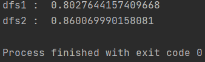

# DFS

- 비선형 구조인 그래프로 표현된 자료들을 빠짐없이 탐색하는것
- 깊이우선탐색으로 스택(stack)을 사용한다.


## Process

1. 시작점 v 방문
2. v에서 갈수있는 노드들중 방문하지않은 노드를 stack에 push
3. stack의 원소를 pop해서 v로 지정하고, 2의 과정을 반복
4. 스택이 공백이 될 때까지 반복

**이런 process도 있다. visit 순서는 같지만 stack에 쌓이는 과정이 다름**

1. 시작점 v 방문
2. 방문하지 않은 정점 w가 있으면 v를 스택에 push하고, w를 방문 후 w를 v로 취급하며 이를 반복
3. v에서 갈수있는 곳중 방문하지 않은 정점이 없으면(다 방문했으면) 스택을 pop해서 가장 마지막 방문 정점을 v로 해서 이를 반복
4. 스택이 공백이 될 때까지 반복


## Code

**1. 스택 사용**

```PYthon
def dfs1(v):
    """
    :param v: str
    """
    visited = []
    stack = Stack()
    stack.push(v)  # 처음 방문
    while not stack.is_empty():  # 스택이 비어있지 않다면
        v = stack.pop()
        if graph.get(v):  # v에서 갈 곳이 있으면
            for node in graph.get(v):
                if node not in visited:  # 방문안한 곳이면
                    stack.push(node)
                    visited.append(node)
                    print(node)
    return visited
```

**2. 재귀 사용**

```Python
visitied = []
def dfs2(v):
    """
    :param v: str
    """
    visited.append(v)
    print(node)
    for n in graph[v]:
        if n not in visited:
            dfs(n, visited)
```


## 속도 비교

```PYthon
class Stack:
    """
    LIFO
    """
    def __init__(self):
        self.elements = []

    def push(self, element):
        self.elements.append(element)

    def pop(self):
        if self.elements:  # 원소의 개수가 0이 아니면
            return self.elements.pop()
        else:
            return None

    def is_empty(self):  # 스택이 비었는지 확인
        if self.elements:
            return False
        else:
            return True

import random
from time import time
graph = {}
for i in range(100000):  # 주어진 edge 개수
    key, val = random.randint(0, 1000), random.randint(0, 1000)
    if graph.get(key):
        graph[key].append(val)
    else:
        graph[key] = [val]

for key in graph:
    graph[key] = list(set(graph[key]))

start = time()
dfs1(1)
print('dfs1 : ', time() - start)

start = time()
visitied = []
dfs2(1)
print('dfs2 : ', time() - start)
```




- dfs1 : 스택이용 / dfs2 : 재귀 이용 

  -> 거의 차이가 없다

```Python
for i in range(100000):  # 주어진 edge 개수
    key, val = random.randint(0, 5000), random.randint(0, 5000)
```

- 단 이렇게 node의 개수가 커지면 dfs2(재귀)의 경우 recursion error가 뜬다.(dfs1의 경우 약 6초정도 걸리는것)