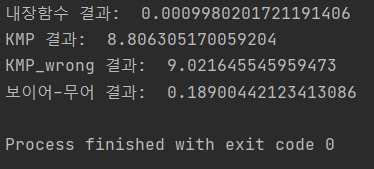

# 패턴매칭

## 개요

```Python
pattern = 'abc'
text = 'zxcasdqwe'
# text에서 pattern이 존재하는지, 존재한다면 시작 index 탐색
```

## Algorithms

- Brute Force : 한칸씩 옮겨가며 다 해보는것

- KMP : 패턴을 전처리해서 좀더 효율적으로
- 보이어-무어 : 가장 많이 쓰이는 알고리즘


### Brute Force

> O(mn)

자세한 설명은 생략


### KMP - 작동원리를 잘못이해한 버전

> 평균 : O(m+n), 최악 : O(m+n)

**알고리즘 개요** : 패턴에서 각 인덱스까지의 시작과 끝을 조사해서 같은 경우가 있다면 건너뛸 때 거기까지만 건너뛰는 것

**예시**

```Python
pattern = 'abcabe'
text = 'abcabzxcaabc'
```

- pattern_preprocessed 구하기

  1. pattern[:0] 에서 겹치는지 판단(원소가 없으니 0인데 뒤에 무한루프 방지하게위해 -1 추가)

  2. pattern[:1] 에서 겹치는지 판단(원소가 한개니까 무조건 0)

  3. pattern[:2] 에서 겹치는지 판단(ab 안겹치니 0)

  4. pattern[:3] 에서 겹치는지 판단(abc 안겹치니 0)

  5. pattern[:4] 에서 겹치는지 판단(abca에서 a겹치니 1)

  6. pattern[:5] 에서 겹치는지 판단(abcab에서 ab겹치니 2)

  7. pattern[:6]에서 겹치는지 판단(abcabe에서 안겹치니 0)

     -> [-1, 0, 0, 0, 1, 2, 0] 반환

- pattern 인식

  text의 맨처음(0번째)부터 abcab까지는 일치했으나 그다음 z가 나와 일치하지 않는 문자열이라고 판단이 되었고, 다음 검사를 시작할 지점을 1번째 지점이 아닌 ab가 다시 등장한 **3**번째 지점부터 시작(**5**번째인덱스(z)에서 시작한 후 pattern_preprocessed[5] = **2**를 뺀 값)한다.

```Python
pattern = 'abc'
text = 'abwezxcabc'
```

위와같은 경우라면 pattern에서 전처리가 필요없다. 1번째 인덱스까지는 일치하고(ab) 2번째 인덱스에서 불일치가 발생하므로 다음 검사를 시작할 인덱스는 2번째가 된다.(Brute Force의 경우 다음 검사 시작인덱스는 1번째)

**Code**

```Python
def kmp(pattern, text):
    """
    text에 pattern이 존재하는지 판단(KMP)
    :param pattern: str
    :param text: str
    :return: bool(o or 1)
    """

    def preprocess_pattern(pattern):
        """
        패턴을 입력받아 전처리를 하는 과정
        해당 인덱스는 몇번 뒤로 돌아가야하는지를 의미함
        :param pattern: str
        :return: list
        """
        pattern_preprocessed = [-1]
        for i in range(1, len(pattern)):
            sub_pattern = pattern[:i]
            j = len(sub_pattern) // 2
            while j > 0:
                if sub_pattern[:j] == sub_pattern[-j:]:
                    break
                j -= 1
            pattern_preprocessed.append(j)
        return pattern_preprocessed

    pattern_preprocessed = preprocess_pattern(pattern)
    text_len = len(text)
    pattern_len = len(pattern)

    if pattern_len > text_len:  # 패턴이 더 긴 경우
        return 0

    i = 0
    while i <= text_len - pattern_len:
        j = 0
        while j < pattern_len:
            if text[i + j] != pattern[j]:
                break
            j += 1
        if j == pattern_len:  # 패턴을 찾은 경우
            return 1
        # j=1일때, pattern_preprocessed[j]는 무조건 0이므로 무한루프 안돈다.
        i += j  # 확인한 인덱스까지 건너뜀
        i -= pattern_preprocessed[j]  # 양끝이 같은 패턴이 있는경우 돌아감

    return 0
```


### KMP - 제대로된 KMP

> 평균 : O(m+n), 최악 : O(m+n)

**알고리즘 개요** : 패턴에서 각 인덱스까지의 시작과 끝을 조사해서 같은 경우가 있다면 건너뛸 때 거기까지만 건너뛰는 것

**예시**

```Python
pattern = 'abcabe'
text = 'abcabzxcaabc'
```

- pattern_preprocessed 구하기는 위와 동

- pattern 인식 부분에서 위(잘못이해한 버전)의 경우에는 text를 순회(i)하다 뒤로 돌아가는 과정(-j)을 반복하며 진행되었는데, 다시 생각해보면  뒤로 돌아가지말고, pattern의 인덱스(j)를 앞으로 땡기면 되는 문제였다. 즉 위의 경우 i=5 (text[5] = 'z')인 지점에서 불일치가 발생하므로 i를  pattern[5]=2 만큼 뒤로 옮기는게 아니라 순회하고있던 패턴의 인덱스(j)를 2(pattern_preprocessed [2] = 'c')로 옮기고 i=5와 비교하면 되는 것이다. 

  또한 위에서 구한 pattern_preprocessed의 길이는 7로 pattern의 길이보다 1 긴데, 사실 pattern_preprocessed[6]은 사용될 일이 없다는것을 알 수 있다.('abcabe' 까지 일치하면 그 패턴이 존재하는 것이므로) 그래서 pattern_preprocessed = [0, 0, 0, 0, 1, 2] 가 된다.(여기서는 0번째 인덱스가 -1일 필요도 없다)

- 실행과정

  1. i(text index) 와 j(pattern index)가 한칸씩 차례로 가다가 5에서 불일치 확인
  2. i는 5로 유지되고, j는 pattern_preprocessed[5] = 2로 가서 text[5], pattern[2]가 같은지 확인하고, 또 불일치했으므로 i는 1증가하고 j는 0부터 다시 시작
  3. 만약 text[5] = 'c'로, pattern[2]와 일치했다면 text[6], pattern[3]을 비교해나가며 진행

  과정 1,2,3을 반복하며 진행한다. 이때 i는 매단계 적어도 한칸씩 나아가고, 각 단계마다 pattern을 확인하는 경우도 상수시간에 진행됨을 알 수 있다. 따라서 최악의 시간복잡도는 O(m+n)으로 주어진다.

**Code**

```Python
def kmp(pattern, text):
    """
    text에 pattern이 존재하는지 판단(KMP)
    :param pattern: str
    :param text: str
    :return: bool(o or 1)
    """

    def preprocess_pattern(pattern):
        """
        패턴을 입력받아 전처리를 하는 과정
        해당 인덱스는 몇번 뒤로 돌아가야하는지를 의미함
        :param pattern: str
        :return: list
        """
        pattern_preprocessed = [0]
        for i in range(1, len(pattern)):
            sub_pattern = pattern[:i]
            j = len(sub_pattern) // 2
            while j > 0:
                if sub_pattern[:j] == sub_pattern[-j:]:
                    break
                j -= 1
            pattern_preprocessed.append(j)
        return pattern_preprocessed

    pattern_preprocessed = preprocess_pattern(pattern)
    text_len = len(text)
    pattern_len = len(pattern)

    if pattern_len > text_len:  # 패턴이 더 긴 경우
        return 0

    i = 0
    j = 0
    while i < text_len:  # text에서 pattern을 찾을 수 있는 마지막 인덱스까지 i가 돈다
        if text[i] == pattern[j]:  # 값이 같으면 계속 돌자
            i += 1
            j += 1
        else:
            if text[i] == pattern[pattern_preprocessed[j]]:  # i는 그대로두고 j만 변환
                i += 1
                j = pattern_preprocessed[j] + 1
            else:
                i += 1
                j = 0
        if j == pattern_len:  # pattern 끝까지 일치했을 경우
            return 1
    return 0
```


### 보이어-무어

> 평균 : O(m+n), 최악 : O(mn)

**알고리즘 개요** : 첫번째 인덱스부터 패턴여부를 확인하고, 

1. 만약 오른쪽 끝에 있는 문자가 불일치하고, 이 문자가 pattern에 없을경우 바로 pattern만큼 건너뜀. 
2. 만약 pattern에 있을 경우 오른쪽부터 왼쪽으로 읽으면서 가장 처음나온 위치와 text의 오른쪽문자위치를 일치시킴.
3. 만약 pattern의 끝문자와 일치한다면 차례로 해당 pattern과 text를 비교하며 패턴인식, 일치안한다면 2의 과정을 통해 점프

**예시**

```PYthon
pattern = 'abcabe'
text = 'abcabzxcewacewerq'
```

1. 처음 텍스트 비교하면 sub_text = 'abcabz'로 마지막 글자(z)가 pattern의 마지막글자(e)와 다르고 pattern에 속하지도 않기때문에 바로 건너뛰고 xcaa~ 부터 비교한다.
2. 두번째 비교에서 'zxcewa'에서 마지막 글자(a)가 pattern에 속하고 pattern에서 오른쪽으로부터 3번째에 a가 처음등장하므로 2(3-1)칸만 이동해서 'cewace'부터 살핀다.(오른쪽으로부터 3번째에 pattern과 text a가 존재)

3. 세번재 비교에서 마지막 글자(e)가 pattern의 마지막글자와 일치하므로 해당 문자열 'cewace'가 pattern과 일치하는지 살피고, 만약 다를경우 pattern의 마지막글자를 제외한 부분에서 e가 포함되는지 살피고, 없다면 과정1을, 있다면 과정2를 진행한다.

**Code**

```Python
def bomu(pattern, text):
    """
    text에 pattern이 존재하는지 판단(보이어-무어 알고리즘)
    :param pattern: str
    :param text: str
    :return: bool(0 or 1)
    """
    def isin(char, string):
        """
        오른쪽으로부터 몇번째에 해당 문자가 존재하는지 반환
        :param char: str, length is 1
        :param string: str
        :return:
        """
        for idx, s in enumerate(string[::-1]):
            if s == char:
                return idx
        else:  # 없는 경우
            return -1

    text_len = len(text)
    pattern_len = len(pattern)
    pattern_last = pattern[-1]

    i = 0
    while i <= text_len - pattern_len:

        if text[i + pattern_len - 1] != pattern_last:  # 마지막 문자가 다를 경우
            jump = isin(text[i + pattern_len - 1], pattern)  # pattern의 오른쪽에서 n번째 있는 값
            if jump == -1:  # pattern에 해당 문자가 없으면

                i += pattern_len  # 쭉 건너뛴다
            else:
                i += jump  # jump만큼 건너뛴다

        else:  # 마지막 문자가 같을 경우
            # 해당패턴이 맞는 지확인
            j = pattern_len - 2  # 마지막 문자가 같으므로 살펴볼필요가없다
            while j >= 0:
                if pattern[j] != text[i + j]:
                    break
                j -= 1
            if j == -1:  # 끝까지 다 일치할 경우
                return 1
            jump = isin(text[i + pattern_len - 1], pattern[:-1])
            if jump == -1:
                i += pattern_len
            else:
                i += jump + 1  # +1을 하는 이유는 마지막글자가 일치하므로 제외했기 때문
    return 0
```


### 속도 Check

```Python
def make_test(pn, tn):
    pattern = ''
    text = ''
    for i in range(pn):
        pattern += chr(random.randint(ord('A'), ord('z')))
    for i in range(tn):
        text += chr(random.randint(ord('A'), ord('z')))
    return pattern, text

pattern, text = make_test(10000, 100000)
start = time()
result = pattern in text
print('내장함수 결과: ', time() - start)

start = time()
result = kmp(pattern, text)
print('KMP 결과: ', time() - start)

start = time()
result = kmp_wrong(pattern, text)
print('KMP_wrong 결과: ', time() - start)

start = time()
result = bomu(pattern, text)
print('보이어-무어 결과: ', time() - start)
```



내장함수가 압도적으로빠르고, 보이어-무어가 KMP에 비해 빠름을 알 수 있다.