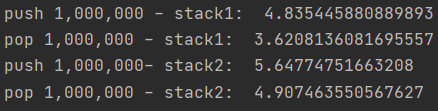

# Stack

- 마지막에 들어간 원소가 가장 먼저 나오는 자료구조(LIFO)
- DFS 등에 활용


## Code

**1. list append를 이용한 구현**

```Python
class Stack1:
    def __init__(self):
        self.elements = []

    def push(self, element):
        self.elements.append(element)

    def pop(self):
        if self.elements:  # 원소의 개수가 0이 아니면
            return self.elements.pop()
        else:
            return None

    def is_empty(self):  # 스택이 비었는지 확인
        if self.elements:
            return False
        else:
            return True
```

**2. list index를 이용한 구현**

```Python
class Stack2:
    def __init__(self, n):
        self.n = n
        self.top = -1
        self.elements = [0] * n

    def push(self, element):
        if self.top >= self.n - 1:  # 들어갈 자리가 없으면
            return None
        self.top += 1
        self.elements[self.top] = element

    def pop(self):
        if self.top >= 0:  # 원소의 개수가 0이 아니면
            self.top -= 1
            return self.elements[self.top+1]
        else:
            return None

    def is_empty(self):  # 스택이 비었는지 확인
        if self.top >= 0:
            return False
        else:
            return True
```


## 속도 비교

```Python
start = time()
stack = Stack1()
n = int(10e+6)
for i in range(n):
    stack.push(i)
print('push 1,000,000 - stack1: ', time() - start)
start = time()
for i in range(n):
    stack.pop()
print('pop 1,000,000 - stack1: ', time() - start)

# -----list index
start = time()
stack = Stack2(n)
for i in range(n):
    stack.push(i)
print('push 1,000,000- stack2: ', time() - start)

start = time()
for i in range(n):
    stack.pop()
print('pop 1,000,000 - stack2: ', time() - start)
```




- stack1이 list append사용, stack2가 list index를 사용한 것이다.

-> 크게 차이없다